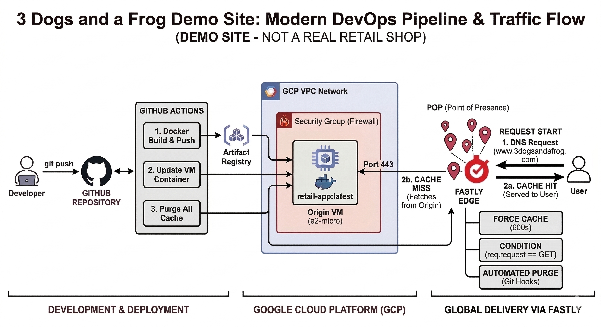

# 🐾 3 Dogs and a Frog - Outdoor Gear

> [!IMPORTANT]
> **DEMO SITE DISCLAIMER:** This is a technical demonstration project for a cloud engineering portfolio. This is **not** a real retail shop. No products are for sale, and no financial transactions are processed.

This repository contains the full-stack e-commerce storefront for **3 Dogs and a Frog**, featuring a containerized Node.js application, Google Cloud Platform (GCP) integration, and a Fastly Global CDN managed via Infrastructure as Code (IaC).

---

## 🏗️ Architecture Diagram
The following diagram illustrates the "Cattle, not Pets" deployment pipeline and the global traffic flow.



### The Golden Flow:
1.  **Developer Push:** Code is pushed to GitHub.
2.  **GitHub Actions:** Builds Docker image -> Pushes to Google Artifact Registry -> Updates VM -> **Purges Fastly Cache** via API.
3.  **Global Delivery via Fastly:** Users initiate requests (`www.3dogsandafrog.com`), hitting the Fastly VCL Edge. Fastly either serves a cached `HIT` (instant delivery) or fetches a `MISS` from the GCP Origin (VM) on Port 443.

---

## ⚡ CDN & Caching Logic (Fastly VCL)
Our edge configuration is defined in `infra/main.tf` to ensure high performance and origin shielding.

### Cache Rules:
* **Force Cache for Frontend:** We explicitly override origin headers to cache the storefront for **3600 seconds (1 hour)**. This ensures the site remains online even if the origin server reboots or is scaling.
* **Request Condition:** Caching is strictly limited to `GET` requests (`req.request == "GET"`) to prevent accidental caching of sensitive POST data or administrative actions.
* **Automated Purging:** Every successful GitHub deployment triggers a `PURGE ALL` API call, instantly invalidating the global cache so users see new application code immediately.

---

## 🛠️ Local Development
To run the storefront on your machine for testing content changes:

1.  **Prerequisites:** Install [Docker Desktop](https://www.docker.com/products/docker-desktop/).
2.  **Spin up the app:**
    ```zsh
    docker-compose up --build
    ```
3.  **Access:** Open `http://localhost:8080` in your browser.

---

## 🚀 How to Deploy Changes

### 1. Content & Application Changes (HTML, CSS, JS)
* **Action:** `git add .` -> `git commit -m "update"` -> `git push origin main`
* **Effect:** Triggers the automated CI/CD pipeline (Build, Deploy, Purge).
* **Verification:** Check GitHub Actions tab for success. Changes are instant.

### 2. Infrastructure & Networking Changes (VM, Firewall, CDN)
All cloud resources are managed via Terraform in the `/infra` directory.
* **Action:**
    ```zsh
    cd infra
    terraform plan   # Preview what will change
    terraform apply  # Execute changes (type 'yes')
    ```
* **Verification:** Check GCP or Fastly Dashboards to confirm resource states.

---

## 📁 Project Structure
* `infra/`: Terraform HCL files (Providers, Variables, and Resources).
* `public/`: Static assets (images, CSS).
* `views/`: EJS Templates for the storefront.
* `.github/workflows/`: YAML definitions for CI/CD and Fastly Purging.
* `app.js`: Express.js server logic.
* `Dockerfile`: Container instructions for the Node.js environment.

---

## ⚠️ Security Requirements
* **Local Secrets:** `infra/terraform.tfvars` (Contains GCP Project ID and Fastly API Key). This file is ignored by Git.
* **CI Secrets:** `FASTLY_API_KEY` and `FASTLY_SERVICE_ID` must be configured in GitHub Repository Secrets.
