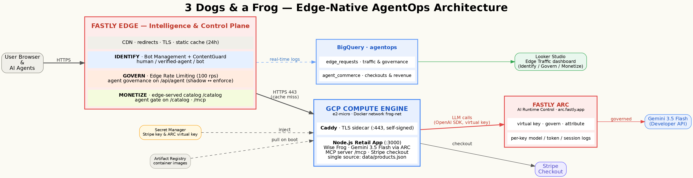

# 🏕️ 3 Dogs and a Frog | Edge-Native Commerce & Agentic Traffic Intelligence

> [!IMPORTANT]
> **DEMO SITE DISCLAIMER:** This is a technical demonstration project. It is **not** a real retail shop. No products are for sale, and no financial transactions are processed.

A full-stack e-commerce demonstration for a luxury outdoor dog-gear brand, fronted by the **Fastly** edge. Beyond the storefront, it is a live testbed for **edge-native traffic intelligence**: every request is classified (human / bot / verified-agent) at the edge, governed by rate limiting, and streamed to BigQuery for real-time observability. Agents can also **transact directly** through an edge-served catalog and a real MCP checkout, governed and monetized at the edge.

**🌐 Live Demo:** [https://www.3dogsandafrog.com](https://www.3dogsandafrog.com)
**📊 Edge Observability (Looker):** *see the "Edge Traffic Classification" dashboard linked in the site footer.*

**🎤 Presenting the demo?** See the **[demo runbook](docs/DEMO-RUNBOOK.md)** — architecture, the shadow/enforce governance toggle, demo-day pre-flight (warm-up), deploy/rollback, and troubleshooting.

---

## 🏗️ Architecture

### The Golden Flow
1.  **Developer Push:** Code is pushed to `main` on GitHub.
2.  **GitHub Actions (single-stage):** Terraform provisions/updates GCP infrastructure **and the full Fastly edge configuration declaratively** (custom VCL, Bot Management + ContentGuard, the edge rate limiter, and BigQuery logging). The workflow then builds/pushes the Docker image and rolls the VM, and finally issues a Fastly `PURGE ALL`.
3.  **Edge Delivery:** Users hit the Fastly edge, which collapses redirects, **classifies the request**, **enforces rate limits**, **logs to BigQuery**, and fetches cache misses from the GCP origin over strict HTTPS (443).
4.  **Sidecar Proxy & Backend:** A **Caddy** container terminates TLS and reverse-proxies to the Node.js `retail-app` container over an isolated Docker network (`frog-net`); the app is a pure backend on **Port 3000**, decoupled from SSL.

---

## 🛰️ Edge Intelligence & Observability

The edge is not just a CDN here — it is the **classification and control plane** for traffic.

* **Bot Management + ContentGuard:** Every request is classified at the edge. `infra/vcl/frog-classify.vcl` stamps `X-Frog-Class` — one of `human`, `bot`, `verified-agent`, or `edge-served` (plus `redirect` for collapsed hops). ContentGuard is enabled declaratively (`product_enablement.bot_management.contentguard = "on"`).
* **Edge Rate Limiting:** `three-dogs-rate-limiter` (~100 rps) shields the `e2-micro` origin from automated floods.
* **AgentOps Telemetry:** Every request is streamed to BigQuery (`agentops.edge_requests`) via the `agentops-bq` logging endpoint, authenticated by **keyless impersonation** of the `fastly-logging` service account (no stored keys). This powers the Looker Studio **"Edge Traffic Classification"** dashboard (traffic mix, % automated, top automated clients, traffic-over-time). A second data set, `agentops.agent_commerce`, drives the **Monetize** row — checkouts and revenue split human vs agent.
* **Wise Frog Assistant:** An in-store AI assistant on **Gemini 3.6** (Vertex AI) — checks inventory, adds to cart, and completes secure Stripe checkouts; the `/api/agent` endpoint is governed at the edge (see Agentic Commerce below).

---

## 🛒 Agentic Commerce & Monetization

Beyond serving humans, the storefront is built for **agents to transact** — and the edge governs that surface.

* **Edge-served catalog (`/catalog`):** the product catalog is served **entirely from the Fastly edge** (an Edge Dictionary populated from `data/products.json` at deploy) — a structured JSON API for agents with no origin hop. Gated to verified agents.
* **MCP endpoint (`/mcp`):** a real Model Context Protocol server (`@modelcontextprotocol/sdk`, JSON response mode) exposing `list_products`, `get_product`, and `checkout` tools to any MCP-capable agent.
* **Verified-agent gate:** `/catalog` and `/mcp` require either a Fastly-classified `verified-agent` **or** the demo header `X-Frog-Agent-Key` (held in the `frog_config` edge dictionary) — otherwise `403`.
* **Agent-surface governance (`/api/agent`):** the Wise Frog endpoint is governed at the edge — humans and verified agents allowed (graduated rate ceilings), untrusted bots gated. A `frog_config` key flips **shadow** (identify only) ↔ **enforce** (block) with no deploy.
* **Checkout + stock safety:** the Wise Frog and the MCP `checkout` tool both create Stripe **test-mode** sessions. Every purchase path validates stock, so **out-of-stock or over-quantity orders are refused** and the storefront shows a disabled "Sold Out".
* **Single source of truth:** `data/products.json` drives the storefront, the Wise Frog, the MCP tools, and the edge catalog — edit once, everything moves.
* **Monetize telemetry:** each checkout stamps `X-Frog-Txn-Amount` / `X-Frog-Txn-Initiator` response headers that the edge logs to BigQuery (`agentops.agent_commerce`), powering the dashboard's **human-vs-agent revenue** split.

---

## ☁️ Infrastructure (Two Terraform Stacks)

State is remote in Google Cloud Storage (`gs://three-dogs-tf-state`), with automatic state locking.

* **`infra/` — CI-applied** (`terraform/state`): the VM origin, the Fastly service (VCL, Bot Management, rate limiter, BigQuery logging), firewall, and billing budget. Applied by the `github-actions-deployer` service account on every push to `main`.
* **`infra/telemetry/` — Owner-applied** (`terraform/telemetry`): the BigQuery dataset/table, the `fastly-logging` service account, and its impersonation + `bigquery.dataEditor` bindings. This plane is deliberately **split out of CI** so the deploy bot needs no project-wide IAM or BigQuery admin. It is applied manually (`cd infra/telemetry && terraform apply`) and changes rarely.

---

## 🔐 Security & Least-Privilege

* **CI deploy identity (`github-actions-deployer`):** scoped to exactly what a deploy needs — ArtifactRegistry Writer, Compute Instance Admin, Service Account User, and Secret Manager Accessor/Viewer. **No project-wide `setIamPolicy`, no service-account admin, no BigQuery write.**
* **Origin identity (default compute SA):** scoped to image pull (ArtifactRegistry Reader), secret read (Secret Manager Accessor), and **write-only** observability (Logging / Monitoring / Telemetry Writer). **No `Editor`.**
* **Secrets:** `STRIPE_SECRET_KEY` and `GEMINI_API_KEY` live in GCP Secret Manager, injected at runtime. Local Terraform variables live in `infra/.envrc` (managed via `direnv`, git-ignored).
* **Container:** runs strictly as the non-root `node` user; a strict `.dockerignore` keeps local `.env`/`infra/` files out of the image.
* **Telemetry plane isolation:** see the two-stack split above.

---

## ⚡ CDN & Caching Logic (Fastly Edge)

Edge behaviour is defined declaratively in `infra/main.tf` for performance and origin shielding.

* **Collapsed Redirects:** HTTP and apex requests are redirected to secure `www` in a single hop.
* **Aggressive Static Caching:** origin cookies are stripped from static assets (JPG, PNG, JS, CSS) at the edge, forcing a **24-hour (86400s) TTL**.
* **Origin Shielding:** stripping `Set-Cookie`/`Vary` on static files maximizes Cache Hit Ratio and protects the `e2-micro` origin.
* **Automated Purging:** every successful deployment triggers a `PURGE ALL`.

---

## 🛠️ Local Development

1.  **Clone:**
        git clone https://github.com/dctheobald/three-dogs-and-a-frog.git
2.  **Prerequisites:** Docker Desktop, Node.js, `direnv`, Google Cloud SDK.
3.  **Sync Secrets:** copy `.envrc` (root), `.env` (root), and `infra/.envrc` from an authorized machine, then run `direnv allow` in both the project root and `infra/`.
4.  **Initialize Infrastructure:**
        cd infra
        gcloud auth application-default login
        terraform init
        terraform apply
    *This connects to the shared GCS state and applies the full edge configuration — VCL, Bot Management, rate limiter, and BigQuery logging — in a single stage. (The BigQuery/telemetry plane is a separate Owner-applied stack in `infra/telemetry/`.)*

### 🏃‍♂️ Running the Application Locally
1. Ensure `.env` holds your Stripe and Gemini keys.
2. Run:
        npm install
        npm start
3. Open `http://localhost:3000`.

---

## 🚀 Deploying Changes

### 1. Application Updates (Node.js, EJS, CSS)
Fully automated: commit and `git push origin main`. GitHub Actions builds the Docker image and rolls the GCP VM.

### 2. Infrastructure Updates (Terraform / Fastly VCL / edge policy)
Apply manually for rapid testing (`cd infra && terraform apply`) or via the Actions pipeline. The entire Fastly edge config — VCL, Bot Management, the rate limiter, and BigQuery logging — is **declarative in `infra/main.tf`**; there is no separate security-layering script. The `infra/telemetry/` stack is applied on its own, Owner-side, when the BigQuery/SA plane changes.

---

## 📁 Project Structure
* `infra/`: Terraform (`main.tf`, `network.tf`, `providers.tf`, `variables.tf`, `outputs.tf`).
* `infra/vcl/`: Fastly edge VCL snippets (e.g. `frog-classify.vcl`, which stamps `X-Frog-Class`).
* `infra/logging/`: BigQuery log-format definition (`bq-logformat.json`).
* `infra/telemetry/`: Owner-applied Terraform stack (BigQuery + logging SA + impersonation).
* `views/`: EJS templates and reusable partials (`header.ejs`, `footer.ejs`).
* `public/`: static assets (images, CSS, client-side JS).
* `server.js`: Express backend entry point.
* `.github/workflows/`: CI/CD (`deploy.yml`).
* `Dockerfile`: hardened Node.js container build.

---

## ⚠️ Security Requirements
* **Infrastructure Secrets:** `infra/.envrc` (via `direnv`) holds the GCP Project ID, Fastly API key, and Terraform variables. Git-ignored.
* **GCP Secrets:** `STRIPE_SECRET_KEY` and `GEMINI_API_KEY` in GCP Secret Manager, injected at runtime.
* **CI Secrets (GitHub):** `GCP_CREDENTIALS`, `GCP_PROJECT_ID`, `GCP_BILLING_ACCOUNT_ID`, `FASTLY_API_KEY`, `FASTLY_SERVICE_ID`.
* **Terraform Metadata:** the VM `app_image` tag is injected by GitHub Actions; Terraform ignores it via a lifecycle block to avoid overwriting the live image.
* **Docker Security:** container runs as non-root `node`; strict `.dockerignore`.
