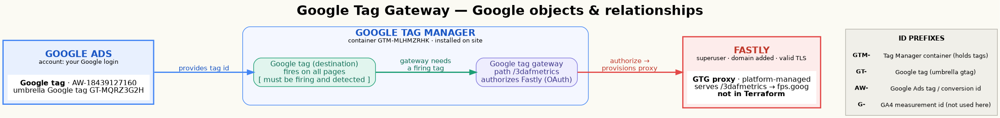

# Google Tag Gateway (GTG) — Operational Note

Google Tag Gateway (Fastly Ad Tag Gateway) is **enabled** on `www.3dogsandafrog.com`.
It serves the Google tag first-party through the Fastly edge, so measurement traffic
runs on our own domain instead of `googletagmanager.com` / `google-analytics.com`.

It was enabled through **Google Tag Manager**, and it is **not** managed by this repo's
Terraform. Read the next section before touching `infra/`.

The diagram below maps the Google objects and the order they must be configured in.



*Regenerate from source: `dot -Tpng docs/gtg-object-map.dot -o docs/gtg-object-map.png` (same toolchain as `architecture.dot`).*

---

## The Google objects & setup order

Each object has to exist before the next — the one that bit us was step 2.

1. **GTM container installed.** `GTM-MLHMZRHK` created and its loader live on the site (in `views/partials/header.ejs`). This is the container that *holds* tags.
2. **A Google tag firing inside the container.** The `AW-18439127160` tag, firing on all pages. **This is the step that silently blocks everything if skipped** — Google won't finish provisioning the gateway while the container is empty, and it sits "Pending / Incomplete" with no error. Confirm the tag actually fires (Tag Assistant) before moving on.
3. **Fastly ready.** The domain added, active, with valid TLS, and you're signed in as a **superuser**.
4. **Enable the Google tag gateway.** Set the measurement path `/3dafmetrics` and authorize Fastly (OAuth). Only then does Fastly's platform stand up the GTG proxy and the path serves first-party.

**The two objects people conflate:** the **Google tag** is the thing that *fires and measures* (referenced by an id like `AW-…`); the **Google tag gateway** is the *setting* that reroutes that tag's traffic first-party. The gateway is useless without a live tag feeding it — that's the whole lesson of step 2.

**ID prefixes** (it's one tag wearing a few id hats):

| Prefix | What it is |
| --- | --- |
| `GTM-` | Tag Manager **container** (holds tags) |
| `GT-`  | **Google tag** (umbrella gtag — Google auto-created `GT-MQRZ3G2H`) |
| `AW-`  | **Google Ads** tag / conversion id (`AW-18439127160`) |
| `G-`   | GA4 measurement id (**not used here**) |

---

## Current configuration

| Item | Value |
| --- | --- |
| Domain | `www.3dogsandafrog.com` |
| Measurement path | `/3dafmetrics` |
| GTM container | `GTM-MLHMZRHK` |
| Destination (Google Ads) | `AW-18439127160` (umbrella Google tag `GT-MQRZ3G2H`) |
| Managed from | Google Tag Manager → Admin → **Google tag gateway** |

---

## ⚠️ This is NOT in Terraform — and must not be added

The gateway routing (`/3dafmetrics` → Google's endpoint) is provisioned and operated by
**Fastly's platform**, out-of-band from our `fastly_service_vcl`. It lives on a separate,
Fastly-managed service and is attached to the **domain**, not to a version of our service.

Consequences:

- `terraform plan` reports **"No changes."** The gateway is invisible to our IaC **by design**.
  That is **not drift** — do not try to "fix" it.
- **Do NOT add an `fps.goog` backend or a `/3dafmetrics` condition/snippet to `infra/main.tf`.**
  It would create a second, competing route for the same path and conflict with the
  platform-managed routing.
- A `terraform apply` on our service does **not** strip the gateway (different object, keyed to
  the domain). It is safe to run applies as normal.

## Why it doesn't show in the Fastly portal

The current rollout phase is Google-UI-managed; there is intentionally **no Fastly-UI indicator**
that GTG is enabled, and no corresponding VCL on our service. Its absence from the portal and
from `terraform plan` is expected, not a misconfiguration.

---

## Verify it's live

```
curl -sI https://www.3dogsandafrog.com/3dafmetrics/healthy
```

Expect `HTTP/2 200` served through Fastly (`via: 1.1 varnish`). For a fuller check, load the
storefront with DevTools → Network and confirm the Google tag loads from
`www.3dogsandafrog.com/3dafmetrics/…` (first-party) rather than a Google domain.

### After any future `terraform apply`

Re-run the health check above and confirm `200`. It is expected to survive service version
bumps; verify anyway before relying on it for a live demo.

---

## Disable / rollback

- Opt out in **Google Tag Manager → Admin → Google tag gateway → Configure → Delete**.
- Fails safe: if the Fastly↔Google link ever drops, the site keeps serving normally — only
  measurement pauses. The gateway cannot take the storefront down.

---

## References

- Object-map diagram source: `gtg-object-map.dot` (renders to `gtg-object-map.png`).
- Fastly public docs: *Fastly Ad Tag Gateway* integration guide (fastly.com/documentation).
- Google setup guide: Tag Manager → Google tag gateway (support.google.com).
- Internal Fastly runbook: Confluence — *"Fastly Ad Tag Manager (Google Tag Gateway)"*
  (CustomerEngineering space). Contains the internal API/architecture/escalation details;
  **do not copy those into this repo.**

---

## Customer / webinar note

Keep Fastly-internal architecture out of customer-facing material. The customer story is:
"enable it in Google Tag Manager; Fastly provisions the edge automatically." The Fastly-UI
toggle is a future phase — today's flow is Google-UI-driven end to end.
